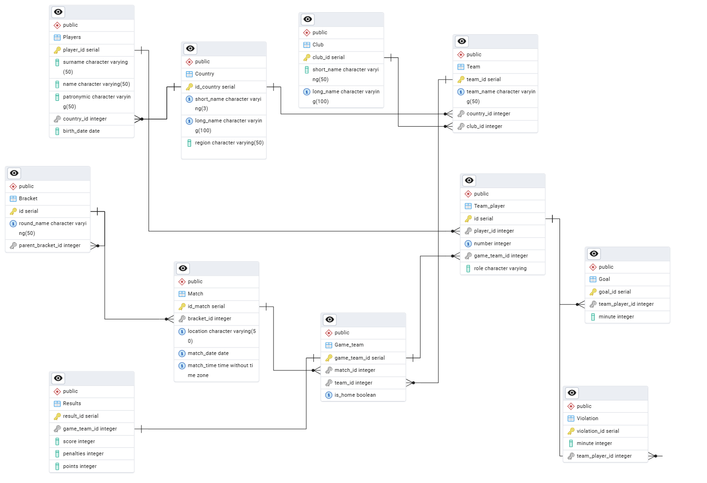

# football-championship
# Информационная система чемпионата по футболу

## Описание проекта
Данный репозиторий содержит структуру и тестовые данные для реляционной базы данных, спроектированной для учёта и анализа произвольного футбольного соревнования на 1 сезон.

Система позволяет отслеживать:
- участников (игроков, команды, страны, клубы);
- расписание матчей и турнирную сетку;
- детальную статистику игр (голы, карточки, результаты);
- составы команд на каждый матч.

## Особенности предметной области
- **Гибкая аффилиация команд:** команда может быть привязана либо к стране (национальные сборные), либо к клубу. У команды может быть только одна из этих связей.
- **Динамика составов:** игроки могут менять команды. Связь между игроком и командой реализована через промежуточную таблицу `Team_player`, что позволяет хранить историю выступлений.
- **Детальная статистика:** учитываются не только итоги матча, но и поминутная статистика (голы, жёлтые/красные/зелёные карточки).
- **Турнирная сетка:** поддержка различных стадий турнира (группы A–D, 1/8, 1/4, 1/2, финал, матч за 3-е место).
- **Серия пенальти:** предусмотрена возможность учитывать результаты послематчевых пенальти.

## Основные сущности
| Сущность | Описание |
|----------|----------|
| `Country` | Справочник стран с регионом |
| `Club` | Справочник футбольных клубов |
| `Players` | Игроки (ФИО, дата рождения, гражданство) |
| `Team` | Команды (сборные или клубы) |
| `Bracket` | Стадии турнира (группы, плей-офф) |
| `Match` | Конкретные матчи (дата, время, место) |
| `Game_team` | Участие команды в матче (дома/в гостях) |
| `Team_player` | Состав команды на матч (номер, позиция) |
| `Goal` | Забитые голы (игрок, минута) |
| `Violation` | Нарушения (карточки, минута) |
| `Results` | Итоги матча (счёт, пенальти, очки) |

## ER-диаграмма
Ниже представлена физическая схема базы данных со всеми связями и ключами.



## Технологии
- **СУБД:** PostgreSQL 12+
- **Язык:** SQL (DDL, DML)
- **Возможности SQL:** JOIN, GROUP BY, оконные функции, CTE, подзапросы, CHECK-ограничения

## Как развернуть базу данных

```bash
# 1. Клонируйте репозиторий на свой компьютер
git clone https://github.com/ageevaksenia01/football-championship.git
cd football-championship

# 2. Создайте новую базу данных (система запросит пароль пользователя postgres)
psql -U postgres -c "CREATE DATABASE football_championship;"

# 3. Выполните скрипт инициализации (создаст таблицы, связи и добавит тестовые данные)
psql -U postgres -d football_championship -f football_project.sql
